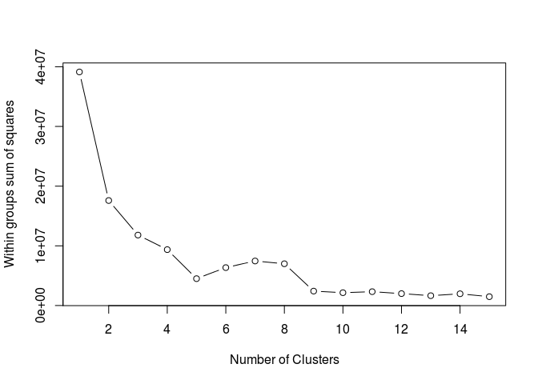
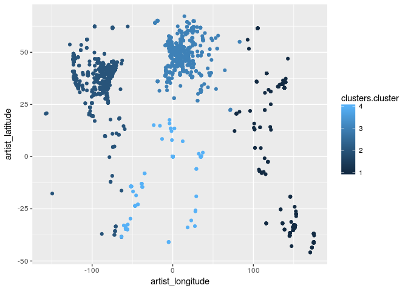

clusterArtist
================
PolozovaEI
20 04 2018

``` r
require(RCurl)
```

    ## Loading required package: RCurl

    ## Loading required package: bitops

``` r
artist <- read.csv(text=getURL("https://raw.githubusercontent.com/olgasilyutina/music_recommender/master/fma_metadata/raw_artists.csv"),header=TRUE, sep="," )
```

``` r
library(dplyr)
```

    ## 
    ## Attaching package: 'dplyr'

    ## The following objects are masked from 'package:stats':
    ## 
    ##     filter, lag

    ## The following objects are masked from 'package:base':
    ## 
    ##     intersect, setdiff, setequal, union

``` r
str(artist)
```

    ## 'data.frame':    16916 obs. of  25 variables:
    ##  $ artist_id               : int  1 10 100 1000 10000 10001 10002 10003 10004 10005 ...
    ##  $ artist_active_year_begin: int  2006 NA 2004 NA NA NA NA NA NA NA ...
    ##  $ artist_active_year_end  : int  NA NA NA NA NA NA NA NA NA NA ...
    ##  $ artist_associated_labels: Factor w/ 812 levels "","\n ","1-2-3-4 Go! Records",..: 1 469 149 1 1 1 1 225 1 1 ...
    ##  $ artist_bio              : Factor w/ 6584 levels "","Aaron Moore - NY via UK. Spinner, blower, and tapper of tubes in Volcano the Bear and (tho' you can't see him) "| __truncated__,..: 645 2918 4922 268 4828 3248 1 1650 1 5136 ...
    ##  $ artist_comments         : int  0 3 1 0 0 1 0 1 0 1 ...
    ##  $ artist_contact          : Factor w/ 1160 levels ""," ","076 415 35 15",..: 171 708 205 1 1 1 1 1 1 1 ...
    ##  $ artist_date_created     : Factor w/ 16761 levels "10/01/2009 05:57:58 AM",..: 2761 2764 2837 4090 4536 5213 5214 5215 5211 5212 ...
    ##  $ artist_donation_url     : Factor w/ 1406 levels ""," ","alteredstatereflections@hotmail.com",..: 1 242 1 1 1 1 1 1 1 1 ...
    ##  $ artist_favorites        : int  9 111 8 0 1 13 2 2 2 8 ...
    ##  $ artist_flattr_name      : Factor w/ 41 levels "","bilgedasto",..: 1 1 1 1 1 1 1 1 1 1 ...
    ##  $ artist_handle           : Factor w/ 16916 levels "_","__","___",..: 1364 8836 2636 9266 6927 10482 2493 4929 14089 1913 ...
    ##  $ artist_image_file       : Factor w/ 7799 levels "https://freemusicarchive.org/file/",..: 586 4006 1194 4198 3114 4756 1126 2198 6417 857 ...
    ##  $ artist_images           : Factor w/ 7799 levels "","[{'image_id': '10003', 'image_file': 'https://freemusicarchive.org/file/images/artists/Nonhorse_-_2010091911380"| __truncated__,..: 2159 1706 6296 4917 517 3222 518 519 520 521 ...
    ##  $ artist_latitude         : num  40.1 34.1 41.9 41.9 NA ...
    ##  $ artist_location         : Factor w/ 2434 levels "","?","04229 Leipzig, Germany",..: 1445 1182 531 1 1 457 1 2081 1 330 ...
    ##  $ artist_longitude        : num  -74.4 -118.2 -87.6 12.6 NA ...
    ##  $ artist_members          : Factor w/ 4375 levels "","?","???","...",..: 3649 2614 805 1 1827 3436 1 1990 3497 1 ...
    ##  $ artist_name             : Factor w/ 16881 levels "_","-","!!!",..: 1339 8784 2608 9214 6877 10412 2464 4891 14018 1886 ...
    ##  $ artist_paypal_name      : Factor w/ 274 levels "","achrest@gmail.com",..: 1 1 1 1 1 1 1 1 1 1 ...
    ##  $ artist_related_projects : Factor w/ 797 levels ""," \n\n","+ & ±",..: 684 1 356 1 1 1 1 1 1 1 ...
    ##  $ artist_url              : Factor w/ 16916 levels "http://freemusicarchive.org/music/__________________/",..: 1364 8836 2636 9266 6927 10482 2493 4929 14089 1913 ...
    ##  $ artist_website          : Factor w/ 7176 levels "","alisternburg.com/music",..: 3472 933 6988 2440 2656 5989 6221 5108 2658 4917 ...
    ##  $ artist_wikipedia_page   : Factor w/ 611 levels "","en.wikipedia.org/wiki/Frazey_Ford",..: 1 1 1 1 1 1 1 1 1 1 ...
    ##  $ tags                    : Factor w/ 16434 levels "[]","['00genesis']",..: 1282 8611 2530 1 6822 10212 2390 4832 13740 1826 ...

``` r
artist_clean <- artist %>% select(artist_id, artist_comments,artist_favorites,artist_latitude, artist_longitude, artist_name)
artist_clean[ , 4:5][is.na(artist_clean[ , 4:5] ) ] = 0 

set.seed(20)

# Determine number of clusters
forclusters <- artist_clean %>% select(artist_comments,artist_favorites,artist_latitude,artist_longitude)
wss <- (nrow(forclusters)-1)*sum(apply(forclusters,2,var))
for (i in 2:15) wss[i] <- sum(kmeans(forclusters,
   centers=i)$withinss)
plot(1:15, wss, type="b", xlab="Number of Clusters",
  ylab="Within groups sum of squares")
```

 A plot of the within groups sum of squares by number of clusters extracted can help determine the appropriate number of clusters. The analyst looks for a bend in the plot similar to a scree test in factor analysis. Scree plot is a decreasing function showing the variance explained by each factor in a factor analysis. One uses it to assess the optimum number of factors to take into account, this happens around "the elbow", the point at which the function plateau, e.g. from there on there is usually no need to take any more factors into account.

``` r
# K-Means Cluster Analysis
clusters <- kmeans(artist_clean[,2:5], 4)
# get cluster means
aggregate(artist_clean[,2:3],by=list(clusters$cluster),FUN=mean)
```

    ##   Group.1 artist_comments artist_favorites
    ## 1       1       0.3682540         5.488889
    ## 2       2       0.4932271         7.527092
    ## 3       3       0.8721190        10.801487
    ## 4       4       0.1439667         1.829594

``` r
# append cluster assignment
artist_clean <- data.frame(artist_clean, clusters$cluster) 
artist <- data.frame(artist, clusters$cluster) 
library(ggplot2)

ggplot(data=artist_clean, aes(x=artist_longitude, y=artist_latitude, color= clusters.cluster )) + geom_point()
```



``` r
ggplot(data=artist_clean, aes(x=artist_longitude, y=artist_latitude, color= clusters.cluster )) + geom_point() 
```


