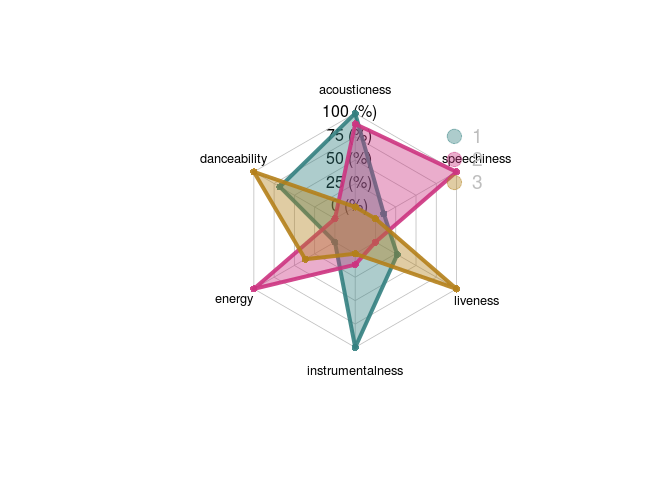
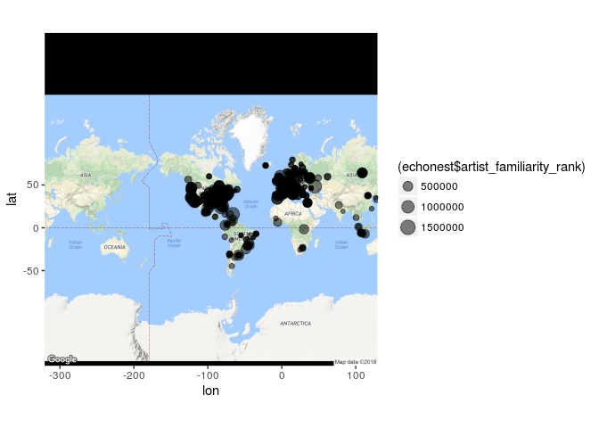
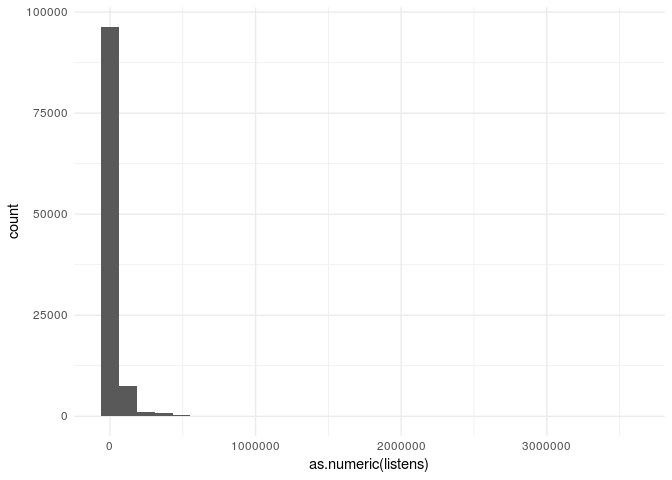
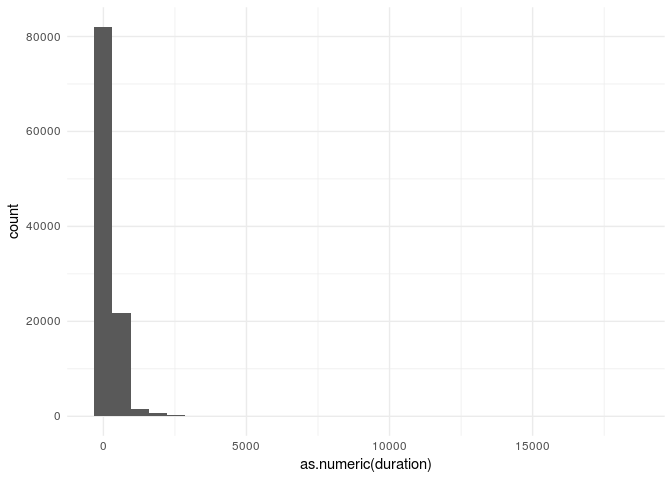
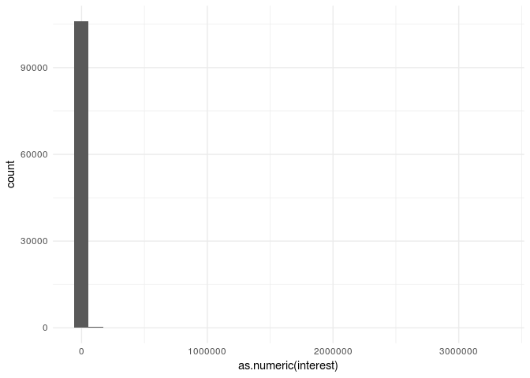
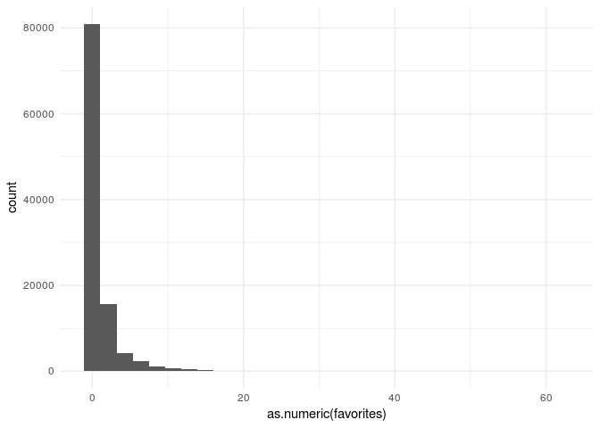
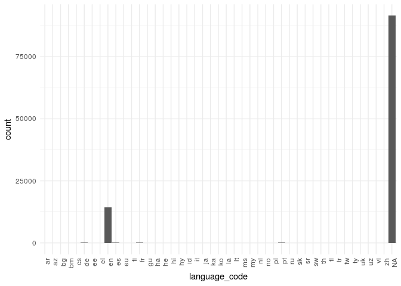
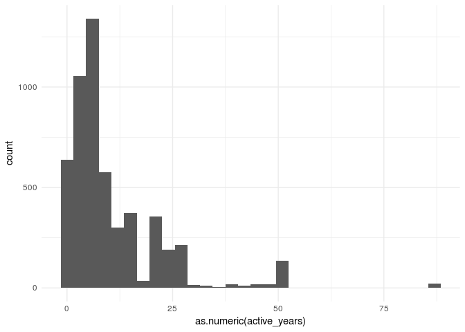

Tracks EDA
================

``` r
library(readr)
echonest <- read_csv("~/project_minor/echonest.csv")
```

    ## Warning: Missing column names filled in: 'X1' [1]

    ## Warning: Duplicated column names deduplicated: 'echonest' =>
    ## 'echonest_1' [3], 'echonest' => 'echonest_2' [4], 'echonest' =>
    ## 'echonest_3' [5], 'echonest' => 'echonest_4' [6], 'echonest' =>
    ## 'echonest_5' [7], 'echonest' => 'echonest_6' [8], 'echonest' =>
    ## 'echonest_7' [9], 'echonest' => 'echonest_8' [10], 'echonest' =>
    ## 'echonest_9' [11], 'echonest' => 'echonest_10' [12], 'echonest' =>
    ## 'echonest_11' [13], 'echonest' => 'echonest_12' [14], 'echonest' =>
    ## 'echonest_13' [15], 'echonest' => 'echonest_14' [16], 'echonest' =>
    ## 'echonest_15' [17], 'echonest' => 'echonest_16' [18], 'echonest' =>
    ## 'echonest_17' [19], 'echonest' => 'echonest_18' [20], 'echonest' =>
    ## 'echonest_19' [21], 'echonest' => 'echonest_20' [22], 'echonest' =>
    ## 'echonest_21' [23], 'echonest' => 'echonest_22' [24], 'echonest' =>
    ## 'echonest_23' [25], 'echonest' => 'echonest_24' [26], 'echonest' =>
    ## 'echonest_25' [27], 'echonest' => 'echonest_26' [28], 'echonest' =>
    ## 'echonest_27' [29], 'echonest' => 'echonest_28' [30], 'echonest' =>
    ## 'echonest_29' [31], 'echonest' => 'echonest_30' [32], 'echonest' =>
    ## 'echonest_31' [33], 'echonest' => 'echonest_32' [34], 'echonest' =>
    ## 'echonest_33' [35], 'echonest' => 'echonest_34' [36], 'echonest' =>
    ## 'echonest_35' [37], 'echonest' => 'echonest_36' [38], 'echonest' =>
    ## 'echonest_37' [39], 'echonest' => 'echonest_38' [40], 'echonest' =>
    ## 'echonest_39' [41], 'echonest' => 'echonest_40' [42], 'echonest' =>
    ## 'echonest_41' [43], 'echonest' => 'echonest_42' [44], 'echonest' =>
    ## 'echonest_43' [45], 'echonest' => 'echonest_44' [46], 'echonest' =>
    ## 'echonest_45' [47], 'echonest' => 'echonest_46' [48], 'echonest' =>
    ## 'echonest_47' [49], 'echonest' => 'echonest_48' [50], 'echonest' =>
    ## 'echonest_49' [51], 'echonest' => 'echonest_50' [52], 'echonest' =>
    ## 'echonest_51' [53], 'echonest' => 'echonest_52' [54], 'echonest' =>
    ## 'echonest_53' [55], 'echonest' => 'echonest_54' [56], 'echonest' =>
    ## 'echonest_55' [57], 'echonest' => 'echonest_56' [58], 'echonest' =>
    ## 'echonest_57' [59], 'echonest' => 'echonest_58' [60], 'echonest' =>
    ## 'echonest_59' [61], 'echonest' => 'echonest_60' [62], 'echonest' =>
    ## 'echonest_61' [63], 'echonest' => 'echonest_62' [64], 'echonest' =>
    ## 'echonest_63' [65], 'echonest' => 'echonest_64' [66], 'echonest' =>
    ## 'echonest_65' [67], 'echonest' => 'echonest_66' [68], 'echonest' =>
    ## 'echonest_67' [69], 'echonest' => 'echonest_68' [70], 'echonest' =>
    ## 'echonest_69' [71], 'echonest' => 'echonest_70' [72], 'echonest' =>
    ## 'echonest_71' [73], 'echonest' => 'echonest_72' [74], 'echonest' =>
    ## 'echonest_73' [75], 'echonest' => 'echonest_74' [76], 'echonest' =>
    ## 'echonest_75' [77], 'echonest' => 'echonest_76' [78], 'echonest' =>
    ## 'echonest_77' [79], 'echonest' => 'echonest_78' [80], 'echonest' =>
    ## 'echonest_79' [81], 'echonest' => 'echonest_80' [82], 'echonest' =>
    ## 'echonest_81' [83], 'echonest' => 'echonest_82' [84], 'echonest' =>
    ## 'echonest_83' [85], 'echonest' => 'echonest_84' [86], 'echonest' =>
    ## 'echonest_85' [87], 'echonest' => 'echonest_86' [88], 'echonest' =>
    ## 'echonest_87' [89], 'echonest' => 'echonest_88' [90], 'echonest' =>
    ## 'echonest_89' [91], 'echonest' => 'echonest_90' [92], 'echonest' =>
    ## 'echonest_91' [93], 'echonest' => 'echonest_92' [94], 'echonest' =>
    ## 'echonest_93' [95], 'echonest' => 'echonest_94' [96], 'echonest' =>
    ## 'echonest_95' [97], 'echonest' => 'echonest_96' [98], 'echonest' =>
    ## 'echonest_97' [99], 'echonest' => 'echonest_98' [100], 'echonest' =>
    ## 'echonest_99' [101], 'echonest' => 'echonest_100' [102], 'echonest' =>
    ## 'echonest_101' [103], 'echonest' => 'echonest_102' [104], 'echonest' =>
    ## 'echonest_103' [105], 'echonest' => 'echonest_104' [106], 'echonest' =>
    ## 'echonest_105' [107], 'echonest' => 'echonest_106' [108], 'echonest' =>
    ## 'echonest_107' [109], 'echonest' => 'echonest_108' [110], 'echonest' =>
    ## 'echonest_109' [111], 'echonest' => 'echonest_110' [112], 'echonest' =>
    ## 'echonest_111' [113], 'echonest' => 'echonest_112' [114], 'echonest' =>
    ## 'echonest_113' [115], 'echonest' => 'echonest_114' [116], 'echonest' =>
    ## 'echonest_115' [117], 'echonest' => 'echonest_116' [118], 'echonest' =>
    ## 'echonest_117' [119], 'echonest' => 'echonest_118' [120], 'echonest' =>
    ## 'echonest_119' [121], 'echonest' => 'echonest_120' [122], 'echonest' =>
    ## 'echonest_121' [123], 'echonest' => 'echonest_122' [124], 'echonest' =>
    ## 'echonest_123' [125], 'echonest' => 'echonest_124' [126], 'echonest' =>
    ## 'echonest_125' [127], 'echonest' => 'echonest_126' [128], 'echonest' =>
    ## 'echonest_127' [129], 'echonest' => 'echonest_128' [130], 'echonest' =>
    ## 'echonest_129' [131], 'echonest' => 'echonest_130' [132], 'echonest' =>
    ## 'echonest_131' [133], 'echonest' => 'echonest_132' [134], 'echonest' =>
    ## 'echonest_133' [135], 'echonest' => 'echonest_134' [136], 'echonest' =>
    ## 'echonest_135' [137], 'echonest' => 'echonest_136' [138], 'echonest' =>
    ## 'echonest_137' [139], 'echonest' => 'echonest_138' [140], 'echonest' =>
    ## 'echonest_139' [141], 'echonest' => 'echonest_140' [142], 'echonest' =>
    ## 'echonest_141' [143], 'echonest' => 'echonest_142' [144], 'echonest' =>
    ## 'echonest_143' [145], 'echonest' => 'echonest_144' [146], 'echonest' =>
    ## 'echonest_145' [147], 'echonest' => 'echonest_146' [148], 'echonest' =>
    ## 'echonest_147' [149], 'echonest' => 'echonest_148' [150], 'echonest' =>
    ## 'echonest_149' [151], 'echonest' => 'echonest_150' [152], 'echonest' =>
    ## 'echonest_151' [153], 'echonest' => 'echonest_152' [154], 'echonest' =>
    ## 'echonest_153' [155], 'echonest' => 'echonest_154' [156], 'echonest' =>
    ## 'echonest_155' [157], 'echonest' => 'echonest_156' [158], 'echonest' =>
    ## 'echonest_157' [159], 'echonest' => 'echonest_158' [160], 'echonest' =>
    ## 'echonest_159' [161], 'echonest' => 'echonest_160' [162], 'echonest' =>
    ## 'echonest_161' [163], 'echonest' => 'echonest_162' [164], 'echonest' =>
    ## 'echonest_163' [165], 'echonest' => 'echonest_164' [166], 'echonest' =>
    ## 'echonest_165' [167], 'echonest' => 'echonest_166' [168], 'echonest' =>
    ## 'echonest_167' [169], 'echonest' => 'echonest_168' [170], 'echonest' =>
    ## 'echonest_169' [171], 'echonest' => 'echonest_170' [172], 'echonest' =>
    ## 'echonest_171' [173], 'echonest' => 'echonest_172' [174], 'echonest' =>
    ## 'echonest_173' [175], 'echonest' => 'echonest_174' [176], 'echonest' =>
    ## 'echonest_175' [177], 'echonest' => 'echonest_176' [178], 'echonest' =>
    ## 'echonest_177' [179], 'echonest' => 'echonest_178' [180], 'echonest' =>
    ## 'echonest_179' [181], 'echonest' => 'echonest_180' [182], 'echonest' =>
    ## 'echonest_181' [183], 'echonest' => 'echonest_182' [184], 'echonest' =>
    ## 'echonest_183' [185], 'echonest' => 'echonest_184' [186], 'echonest' =>
    ## 'echonest_185' [187], 'echonest' => 'echonest_186' [188], 'echonest' =>
    ## 'echonest_187' [189], 'echonest' => 'echonest_188' [190], 'echonest' =>
    ## 'echonest_189' [191], 'echonest' => 'echonest_190' [192], 'echonest' =>
    ## 'echonest_191' [193], 'echonest' => 'echonest_192' [194], 'echonest' =>
    ## 'echonest_193' [195], 'echonest' => 'echonest_194' [196], 'echonest' =>
    ## 'echonest_195' [197], 'echonest' => 'echonest_196' [198], 'echonest' =>
    ## 'echonest_197' [199], 'echonest' => 'echonest_198' [200], 'echonest' =>
    ## 'echonest_199' [201], 'echonest' => 'echonest_200' [202], 'echonest' =>
    ## 'echonest_201' [203], 'echonest' => 'echonest_202' [204], 'echonest' =>
    ## 'echonest_203' [205], 'echonest' => 'echonest_204' [206], 'echonest' =>
    ## 'echonest_205' [207], 'echonest' => 'echonest_206' [208], 'echonest' =>
    ## 'echonest_207' [209], 'echonest' => 'echonest_208' [210], 'echonest' =>
    ## 'echonest_209' [211], 'echonest' => 'echonest_210' [212], 'echonest' =>
    ## 'echonest_211' [213], 'echonest' => 'echonest_212' [214], 'echonest' =>
    ## 'echonest_213' [215], 'echonest' => 'echonest_214' [216], 'echonest' =>
    ## 'echonest_215' [217], 'echonest' => 'echonest_216' [218], 'echonest' =>
    ## 'echonest_217' [219], 'echonest' => 'echonest_218' [220], 'echonest' =>
    ## 'echonest_219' [221], 'echonest' => 'echonest_220' [222], 'echonest' =>
    ## 'echonest_221' [223], 'echonest' => 'echonest_222' [224], 'echonest' =>
    ## 'echonest_223' [225], 'echonest' => 'echonest_224' [226], 'echonest' =>
    ## 'echonest_225' [227], 'echonest' => 'echonest_226' [228], 'echonest' =>
    ## 'echonest_227' [229], 'echonest' => 'echonest_228' [230], 'echonest' =>
    ## 'echonest_229' [231], 'echonest' => 'echonest_230' [232], 'echonest' =>
    ## 'echonest_231' [233], 'echonest' => 'echonest_232' [234], 'echonest' =

    ## Parsed with column specification:
    ## cols(
    ##   .default = col_character()
    ## )

    ## See spec(...) for full column specifications.

``` r
colnames(echonest) <- echonest[2,]
colnames(echonest)[1] <- echonest[3,1]
echonest <- echonest[-c(1:3),]
echonest_part <- echonest[,1:7]
rownames(echonest_part) <- echonest_part$track_id
```

    ## Warning: Setting row names on a tibble is deprecated.

``` r
echonest_part <- echonest_part[,-1]
echonest_part <- data.frame(lapply(echonest_part, function(x) as.numeric(as.character(x))))
echo <- head(echonest_part, 3)
```

``` r
# Library
library(fmsb)
 
colors_border=c( rgb(0.2,0.5,0.5,0.9), rgb(0.8,0.2,0.5,0.9) , rgb(0.7,0.5,0.1,0.9) )
colors_in=c( rgb(0.2,0.5,0.5,0.4), rgb(0.8,0.2,0.5,0.4) , rgb(0.7,0.5,0.1,0.4) )
radarchart( echo  , axistype=1 , maxmin=F,
    #custom polygon
    pcol=colors_border , pfcol=colors_in , plwd=4 , plty=1,
    #custom the grid
    cglcol="grey", cglty=1, axislabcol="black", cglwd=0.8, 
    #custom labels
    vlcex=0.8 
    )
legend(x=0.7, y=1, legend = rownames(echo), bty = "n", pch=20 , col=colors_in , text.col = "grey", cex=1.2, pt.cex=3)
```



``` r
library(lubridate)
```

    ## 
    ## Attaching package: 'lubridate'

    ## The following object is masked from 'package:base':
    ## 
    ##     date

``` r
library(ggplot2)
echonest$artist_latitude <- as.numeric(echonest$artist_latitude)
echonest$artist_longitude <- as.numeric(echonest$artist_longitude)
echonest$artist_familiarity_rank <- as.numeric(echonest$artist_familiarity_rank)

library(ggmap)
```

    ## Google Maps API Terms of Service: http://developers.google.com/maps/terms.

    ## Please cite ggmap if you use it: see citation("ggmap") for details.

``` r
map <- get_map(location = 'World', zoom = 1)
```

    ## Source : https://maps.googleapis.com/maps/api/staticmap?center=World&zoom=1&size=640x640&scale=2&maptype=terrain&language=en-EN

    ## Source : https://maps.googleapis.com/maps/api/geocode/json?address=World

``` r
mapPoints <- ggmap(map) + geom_point(aes(x = artist_longitude, y = artist_latitude, size=(echonest$artist_familiarity_rank)), data = echonest, alpha = .5)
mapPoints
```

    ## Warning: Removed 10677 rows containing missing values (geom_point).



``` r
echonest$album_year <- year(ymd(echonest$album_date))
```

    ## Warning: 495 failed to parse.

``` r
ggplot() + geom_bar(data=echonest, aes(album_year)) + theme_minimal()
```

    ## Warning: Removed 10907 rows containing non-finite values (stat_count).


``` r
tracks <- read_csv("~/project_minor/tracks.csv")
```

    ## Warning: Missing column names filled in: 'X1' [1]

    ## Warning: Duplicated column names deduplicated: 'album' => 'album_1' [3],
    ## 'album' => 'album_2' [4], 'album' => 'album_3' [5], 'album' =>
    ## 'album_4' [6], 'album' => 'album_5' [7], 'album' => 'album_6' [8],
    ## 'album' => 'album_7' [9], 'album' => 'album_8' [10], 'album' =>
    ## 'album_9' [11], 'album' => 'album_10' [12], 'album' => 'album_11' [13],
    ## 'album' => 'album_12' [14], 'artist' => 'artist_1' [16], 'artist' =>
    ## 'artist_2' [17], 'artist' => 'artist_3' [18], 'artist' => 'artist_4' [19],
    ## 'artist' => 'artist_5' [20], 'artist' => 'artist_6' [21], 'artist' =>
    ## 'artist_7' [22], 'artist' => 'artist_8' [23], 'artist' => 'artist_9' [24],
    ## 'artist' => 'artist_10' [25], 'artist' => 'artist_11' [26],
    ## 'artist' => 'artist_12' [27], 'artist' => 'artist_13' [28], 'artist'
    ## => 'artist_14' [29], 'artist' => 'artist_15' [30], 'artist' =>
    ## 'artist_16' [31], 'set' => 'set_1' [33], 'track' => 'track_1' [35], 'track'
    ## => 'track_2' [36], 'track' => 'track_3' [37], 'track' => 'track_4' [38],
    ## 'track' => 'track_5' [39], 'track' => 'track_6' [40], 'track' =>
    ## 'track_7' [41], 'track' => 'track_8' [42], 'track' => 'track_9' [43],
    ## 'track' => 'track_10' [44], 'track' => 'track_11' [45], 'track' =>
    ## 'track_12' [46], 'track' => 'track_13' [47], 'track' => 'track_14' [48],
    ## 'track' => 'track_15' [49], 'track' => 'track_16' [50], 'track' =>
    ## 'track_17' [51], 'track' => 'track_18' [52], 'track' => 'track_19' [53]

    ## Parsed with column specification:
    ## cols(
    ##   .default = col_character()
    ## )

    ## See spec(...) for full column specifications.

``` r
colnames(tracks) <- tracks[1,]
colnames(tracks)[1] <- tracks[2,1]
tracks <- tracks[-c(1:2),]
```

``` r
options(scipen=1000000)
ggplot()+geom_histogram(data=tracks, aes(as.numeric(listens)))+theme_minimal()
```

    ## `stat_bin()` using `bins = 30`. Pick better value with `binwidth`.



``` r
ggplot()+geom_histogram(data=tracks, aes(as.numeric(duration)))+theme_minimal()
```

    ## `stat_bin()` using `bins = 30`. Pick better value with `binwidth`.



``` r
ggplot()+geom_histogram(data=tracks, aes(as.numeric(interest)))+theme_minimal()
```

    ## `stat_bin()` using `bins = 30`. Pick better value with `binwidth`.



``` r
ggplot()+geom_histogram(data=tracks, aes(as.numeric(comments)))+theme_minimal()
```

    ## `stat_bin()` using `bins = 30`. Pick better value with `binwidth`.


``` r
ggplot()+geom_histogram(data=tracks, aes(as.numeric(favorites)))+theme_minimal()
```

    ## `stat_bin()` using `bins = 30`. Pick better value with `binwidth`.



``` r
ggplot()+geom_bar(data=tracks, aes(language_code))+theme_minimal()+theme(axis.text.x = element_text(angle = 90, hjust = 1))
```



``` r
tracks$active_years = year(ymd_hms(tracks$active_year_end)) - year(ymd_hms(tracks$active_year_begin))
ggplot()+geom_histogram(data=tracks, aes(as.numeric(active_years)))+theme_minimal()
```

    ## `stat_bin()` using `bins = 30`. Pick better value with `binwidth`.

    ## Warning: Removed 101246 rows containing non-finite values (stat_bin).


